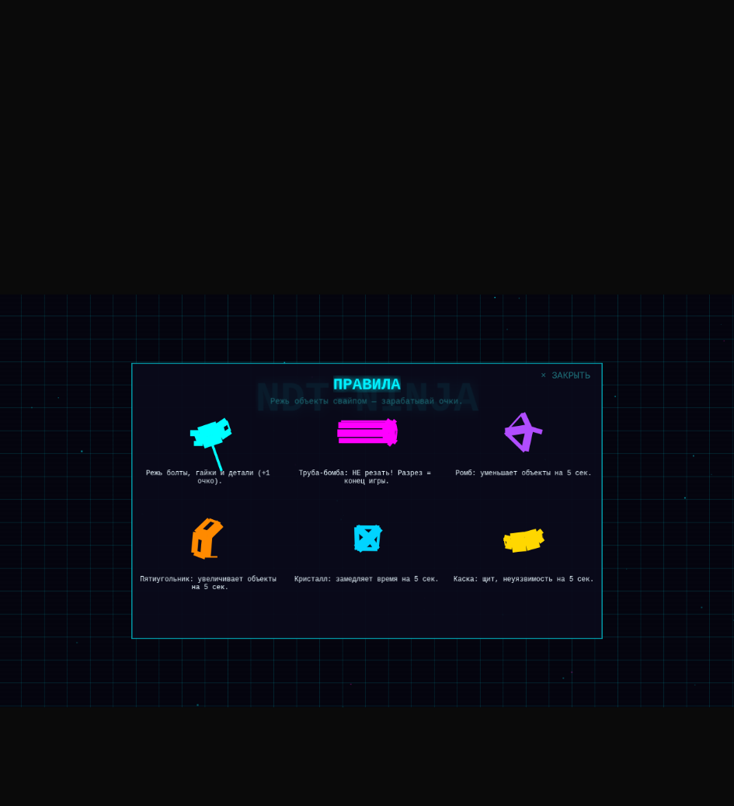

# NDT-Ninja

**NDT-Ninja** — клон Fruit Ninja в тематике неразрушающего контроля (NDT — Non-Destructive Testing).
Игрок клинком-свайпом режет «дефекты» (вместо фруктов), уворачивается от бомб и набирает очки.
Проект реализован как прогрессивное веб-приложение (PWA) и устанавливается на Android-планшет.



## Технологии

| Слой | Технология |
|------|------------|
| Игровой движок | [Phaser 4.2.1](https://phaser.io/) |
| Физика | [Matter.js](https://brm.io/matter-js/) + [PolyK](https://github.com/polyk/PolyK) |
| Декомпозиция полигонов | [poly-decomp](https://github.com/schteppe/poly-decomp.js) |
| Сборщик | [Vite 6](https://vitejs.dev/) |
| Язык | TypeScript 5.6 |
| Тесты | [Vitest 3](https://vitest.dev/) (окружение `jsdom`) |
| PWA | [`vite-plugin-pwa`](https://vite-pwa-org.netlify.app/) (manifest, autoUpdate, generateSW) |
| Деплой | Docker (multi-stage) + nginx |

## Быстрый старт

### Требования

- **Node.js ≥ 18** (рекомендуется 20+; Docker-сборка использует `node:24-alpine`)
- npm, входящий в поставку Node.js

### Локальная установка

```bash
# 1. Установить зависимости
npm install

# 2. Запустить dev-сервер
npm run dev
```

Dev-сервер поднимается на **http://localhost:5173** (порт зафиксен в `vite.config.ts`).
Vite открывает хост на всех интерфейсах (`server.host: true`) — удобно для тестирования с планшета в локальной сети.

### Production-сборка

```bash
npm run build        # сборка в dist/
npm run preview      # предпросмотр собранной версии на http://localhost:4173
```

## npm-скрипты

| Команда | Описание |
|---------|----------|
| `npm run dev` | Dev-сервер Vite с HMR (`http://localhost:5173`) |
| `npm run build` | Production-сборка в `dist/` (target: ES2020, sourcemaps) |
| `npm run preview` | Локальный предпросмотр сборки (`http://localhost:4173`) |
| `npm test` | Unit-тесты Vitest в watch-режиме |
| `npm run test:run` | Unit-тесты Vitest одним прогоном (для CI) |
| `npm run typecheck` | Проверка типов TypeScript (`tsc --noEmit`) |

## make-цели

`Makefile` — тонкая обёртка над npm-скриптами для удобного запуска и автодополнения в shell.

```bash
make            # показать список целей (help)
make install    # npm install
make dev        # dev-сервер
make build      # production-сборка
make test       # тесты в watch
make test-run   # тесты одним прогоном
make typecheck  # проверка типов
make check      # typecheck + test:run (полная проверка перед коммитом)
make clean      # удалить dist/ и кэш Vite
make all        # install + check + build (полный CI-прогон локально)
```

## Docker

Проект поддерживает два сценария контейнерного запуска через `docker-compose.yml`:
**production** (nginx + собранная статика) и **dev** (hot-reload через Vite).

### Production (nginx, порт 8080)

```bash
docker-compose build
docker-compose up -d
```

Приложение доступно на **http://<IP_ХОСТА>:8080**.
Multi-stage `Dockerfile` (stage `builder` → stage `production`):
собирает статику в Node.js, затем копирует `dist/` в образ `nginx:alpine`.
Healthcheck проверяет `http://127.0.0.1/` каждые 30 секунд.

### Dev (hot-reload, порт 5173)

Отдельный профиль `dev` запускает Vite dev-сервер в контейнере `node:24-alpine`
с пробросом `src/`, `public/`, `index.html` и конфигов как томов:

```bash
docker-compose --profile dev up
```

Подробности — в `Dockerfile`, `docker-compose.yml`, `nginx.conf`.

## Структура проекта

```
ninja/
├── src/
│   ├── systems/     # Игровые системы: SliceSystem, BombSystem, ScoreSystem,
│   │                # SpawnDirector, FXSystem, HapticsSystem, LifeSystem,
│   │                # InputSystem, SwordSystem, BodySplitter
│   ├── slice/       # Нарезка геометрии: PolyKSlicer, Decomposer, Geometry
│   ├── objects/     # Игровые объекты: NDTObject, Fragment
│   ├── wave/        # Система волн: WaveState, WaveConfig
│   ├── threed/      # 3D-меши и проекция: Mesh3D, NDTMeshes, Projection
│   ├── input/       # Ввод: TrailBuffer, CoalescedResolver, AudioUnlockState
│   ├── events/      # Шина событий: EventBus, SliceEvent, MissEvent
│   ├── i18n/        # Локализация
│   ├── perf/        # Производительность: FragmentPool, Profiler, HapticsState
│   ├── benchmark/   # Бенчмарки физики (physics-bench)
│   └── __tests__/   # Unit-тесты Vitest (40+ спеков)
├── public/          # Статика: manifest.json, иконки 192/512, звуки, фоны
├── docs/            # Архитектурная документация
├── Dockerfile       # Multi-stage build (Node.js builder → nginx)
├── docker-compose.yml
├── nginx.conf
├── vite.config.ts   # Конфиг Vite + vite-plugin-pwa
├── Makefile         # Обёртка над npm-скриптами
└── package.json
```

## Тестирование

Тесты — на Vitest с окружением `jsdom`, лежат в `src/__tests__/` (40+ spec-файлов).

```bash
npm test            # watch-режим (TDD)
npm run test:run    # один прогон (CI)
make check          # typecheck + test:run
```

Перед коммитом рекомендуется прогонять `make check` — это полный локальный пред-коммит шлюз.

## PWA и Android

Игра упакована как PWA через `vite-plugin-pwa` (`registerType: 'autoUpdate'`, стратегия `generateSW`).
Манифест (`public/manifest.json`):
- `display: standalone`, `orientation: landscape`
- тема и фон `#0a0a1a`
- иконки `192×192` и `512×512` (`purpose: any maskable`)

Инструкция по установке на Android-планшет (с экрана браузера, без сборки APK) — в **[docs/android-installation.md](docs/android-installation.md)**.

## Документация

- **[docs/ndt-ninja-architecture.md](docs/ndt-ninja-architecture.md)** — детальная архитектура: системы, объекты, события, потоки данных.
- **[docs/ndt-ninja-plan.md](docs/ndt-ninja-plan.md)** — план реализации и история релизов.
- **[docs/android-installation.md](docs/android-installation.md)** — установка как Android PWA.
